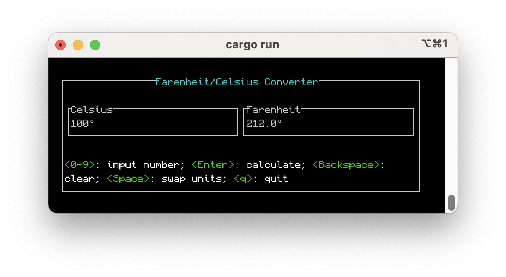

# Rust Farenheit to Celsius Converter
Wrote a TUI Farenheit to Celsius converter using the Ratatui [library](https://github.com/ratatui-org/ratatui).


> the Terminal User Interface

### Installation
Installing straight off this repo into your cargo bin directory:
```
cargo install --git https://github.com/jnorman-us/rust-f-c-converter
```
